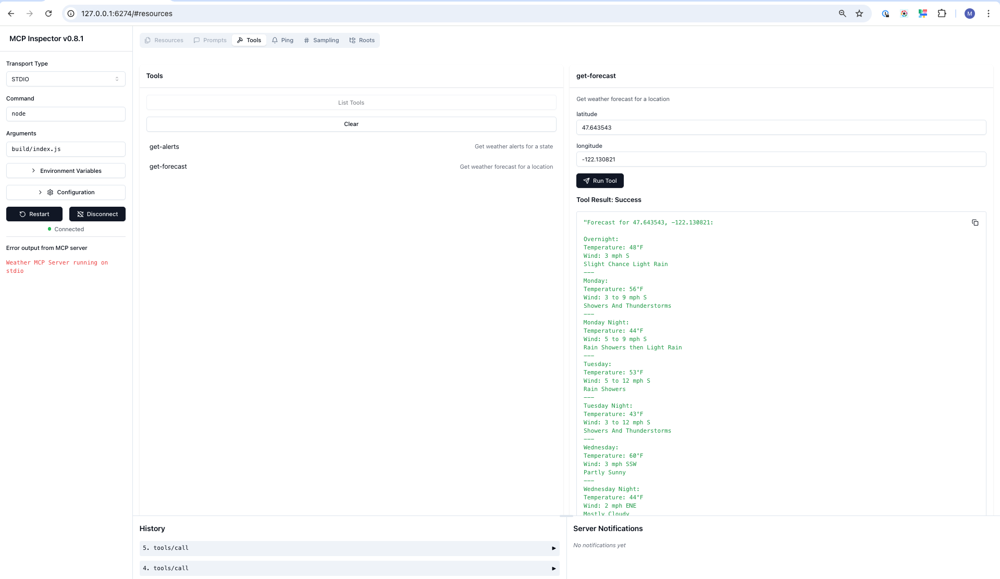

# Simple Weather MCP in Type Script

Node tutorial based on the Quickstart guide
https://modelcontextprotocol.io/quickstart/server#core-mcp-concepts


Claude Desktop:Type in: How is the weather in Redmond (Microsoft)?

1. Build the server:
```bash
npm run build
```

2. Run the server:
```bash
npm run start
```

3. Run the inspector + server:
```bash 
npx @modelcontextprotocol/inspector node build/index.js
```



4. Add the server to Claude Desktop (MacOS) in file `~/.claudia/claude_desktop_config.json`:
```json
{
  "mcpServers": {
    "weather": {
      "command": "node",
      "args": [
        "/Users/ma3u/projects/weather/build/index.js"
      ]
    }
  }
}
```

5. Restart Claude Desktop.
